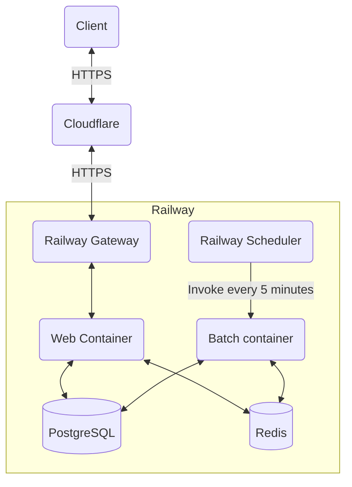

<!--
SPDX-FileCopyrightText: 2024 Kuropen

SPDX-License-Identifier: LicenseRef-KUROPEN-ORG-PUBLIC-CODE
-->

# About this repository
This repository contains Kuropen's personal website.

This is the version started operation on October 19, 2024.

The content is in Japanese.

## Technology Stack
- Backend Program:
    - PHP 8.3
    - Laravel 11
- Database:
    - PostgreSQL 16 (some test is done with SQLite 3)
    - Redis 7.2
- Frontend Program:
    - HTML5
    - CSS3
    - TypeScript 5.6
    - Alpine.js 3
    - Tailwind CSS 3 (with forms and typography plugins)
- Anti-bot:
    - reCaptcha v3
- Logging:
    - Better Stack

## Production Environment

## License for the code
Please see the [LICENSE](LICENSE.md) file for the license of the code.
